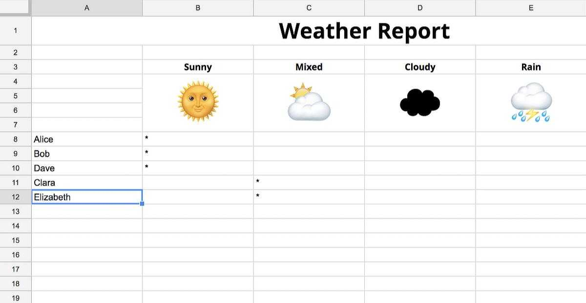
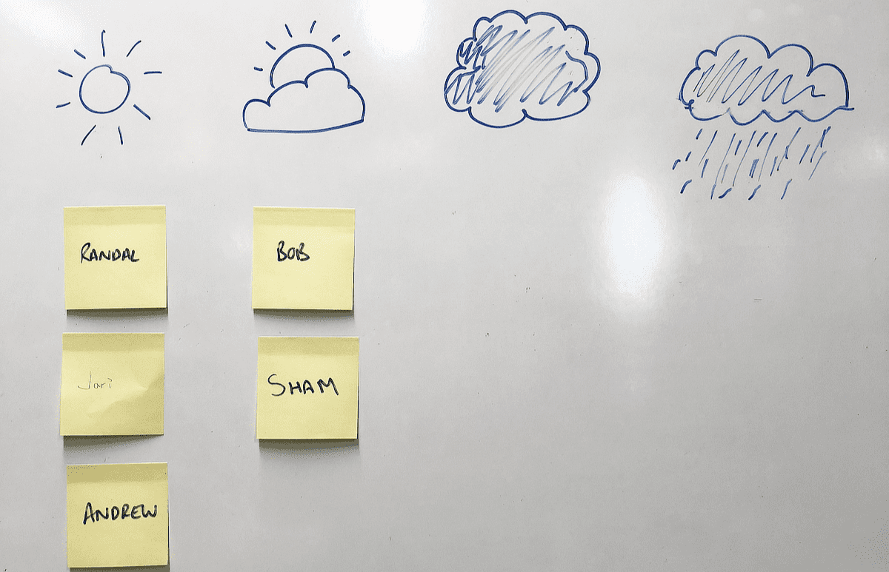
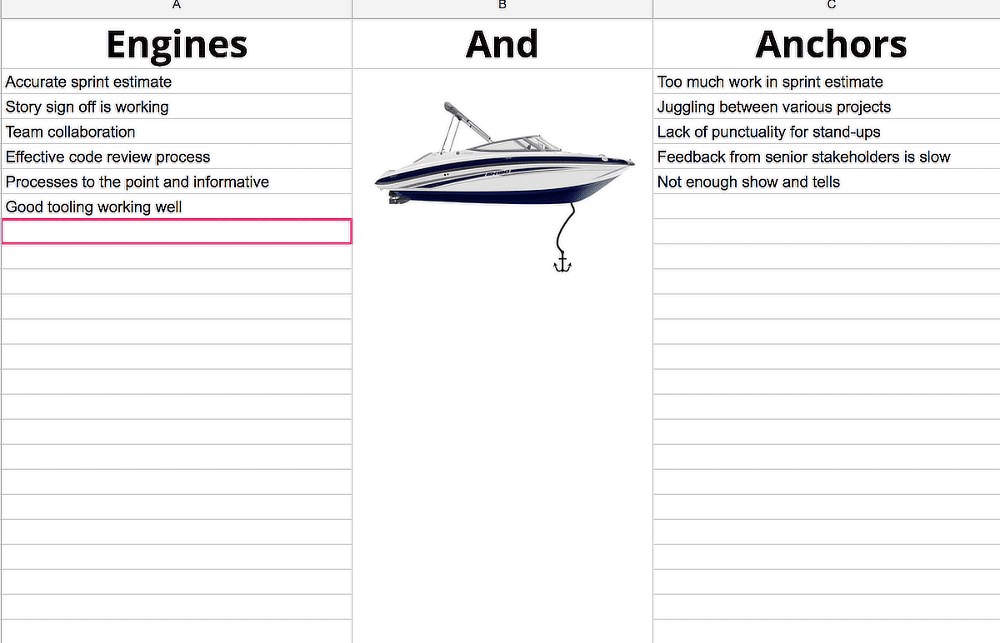
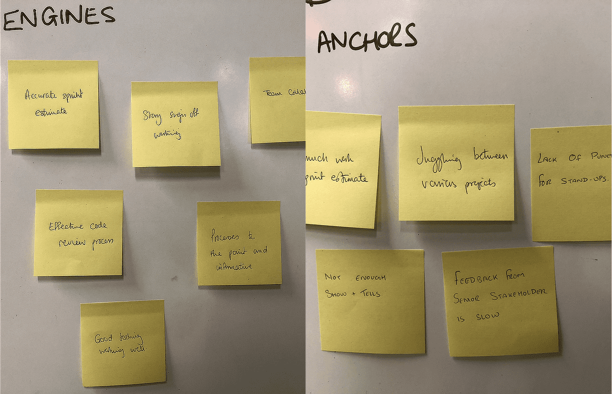
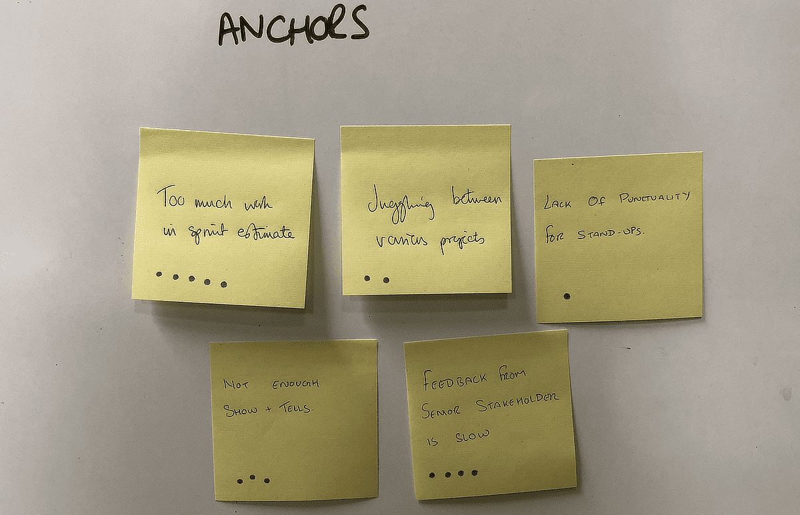

+++
date = '2025-09-29T20:00:13+01:00'
draft = false
title = 'The quickest, easiest, and most effective agile retro ever'
description = 'A quick and easy way to run a retro - even for distributed teams'
+++

If you’re familiar with agile delivery you would have come across “The Retro”. This key agile ceremony promotes team learning through introspection and enables the team to learn, adapt and improve, in true agile style.

Unfortunately, these lofty goals often collide - sometimes they can be unfocused, too long, or don’t work well for remote teams. Often they end up not being effective or just not done at all.

What we present here, whilst not original, is a quick and easy format for running retrospectives that has worked well for me.

It’s fast, lightweight for the facilitator, and easy to run with remote teams. We are a remote-first organisation, so having simple and effective retrospectives, irrespective of where team members are located, is key to how we drive improvements.
How to run this retrospective

To run this retrospective with remote teams, all you need is a video conferencing system (such as Zoom, Google Hangouts, Skype) and access to Google Sheets.

Co-located teams just need some post-its, a whiteboard and someone who can draw a passable impression of a boat.

We’re going to be talking about this retrospective in the context of a scrum sprint, but it’s equally applicable to iterations in lean delivery. This retrospective format contains just two stages that can be predictably timeboxed.

### Step 1 - Weather Report

The Weather Report is a really short exercise to gauge the team’s overall feeling about the sprint using a simple analogy. Everyone places an asterisk alongside their name under the column (Sunny, Mixed, Cloudy or Rainy) which represents best how they feel about the sprint.

To keep this short, give everyone one minute to do this.

Immediately afterwards, each team member gets one sentence to explain why they feel the way they do. The key here is keep it short and punchy - this is just a guide to how people are feeling, not an in-depth discussion. It’s really useful as a warmup exercise to get people talking  and to set the scene.

"I’m feeling cloudy because whilst we were able to develop everything in that sprint, some dependencies were unforeseen which ended up eating up time that was needed for essential sprint tasks."

#### Time needed

* 1 minute to enter data i.e. team members picking their weather mood
* 1 minute per team member to explain why they feel the way they do

So for a team of 6 this step would take 7 minutes.

### Step 2 - Engines and Anchors

This step is where the bulk of our time will be spent. Using the analogy of a boat with ‘engines’ pushing the sprint towards its destination and ‘anchors’ dragging it back, give the team ten minutes to write down under the Engines column things that helped delivery, and under the Anchors column things that hindered delivery.

 

Duplicates are fine (and should be expected) and some things might appear in both columns (a common example is ‘team commitment’ - shorthand for long hours). It’s important to emphasise that the retrospective must be a no-blame environment - we’re working as a team to make things better, not seeking to apportion blame.

The team should take five minutes to complete their engines and anchors.

Next, each member of the team in turn should pick either an engine or an anchor (along with any duplicates or similar ones) and explain to the team why they wrote this down. The team might be in agreement, or they might want to discuss the point further.

To keep the session focussed, try to timebox discussions on each engine or anchor to a maximum of five minutes (using the Google Sheets approach, the facilitator can italicise the engines and anchors that have already been chosen to help the team. In person, the facilitator can simply cross through/highlight engines and anchors that have been addressed).

Continue with each team member picking an engine or anchor and go around until you’re done with all of the engines or anchors, or until 40 minutes is up.

Step 3 - Making iterative improvements
--

Finally, as a team, decide upon what to focus on improving in the next sprint. Each team member gets three ‘votes’. Alongside each of the Anchors every person should place one or more of their votes - the Anchors with the two highest votes should be your focus for improvement in the next sprint.

 

Here's a simple way for co-located teams to vote on anchors for improvement in the next sprint

During the next sprint you can keep these in mind by adding them as a ‘subtitle’ to the name of your next sprint, or maybe even write a bot to remind you of these improvements periodically in your Slack or Teams channels.

##### Time needed

50 minutes (max)

* 5 minutes for entering engines and anchors
* 40 minutes for discussing each ending and anchor as a team
* 5 minutes to highlight 2 areas for improvement to implement in your next sprint

#### Tried, tested, and effective

I’ve run retrospectives using this format with both remote and co-located teams and it’s a great way to keep retrospectives focused, tight and interactive.

This article was originally published at https://wunder.io/en/insights/quickest-easiest-and-most-effective-agile-retrospective-ever
